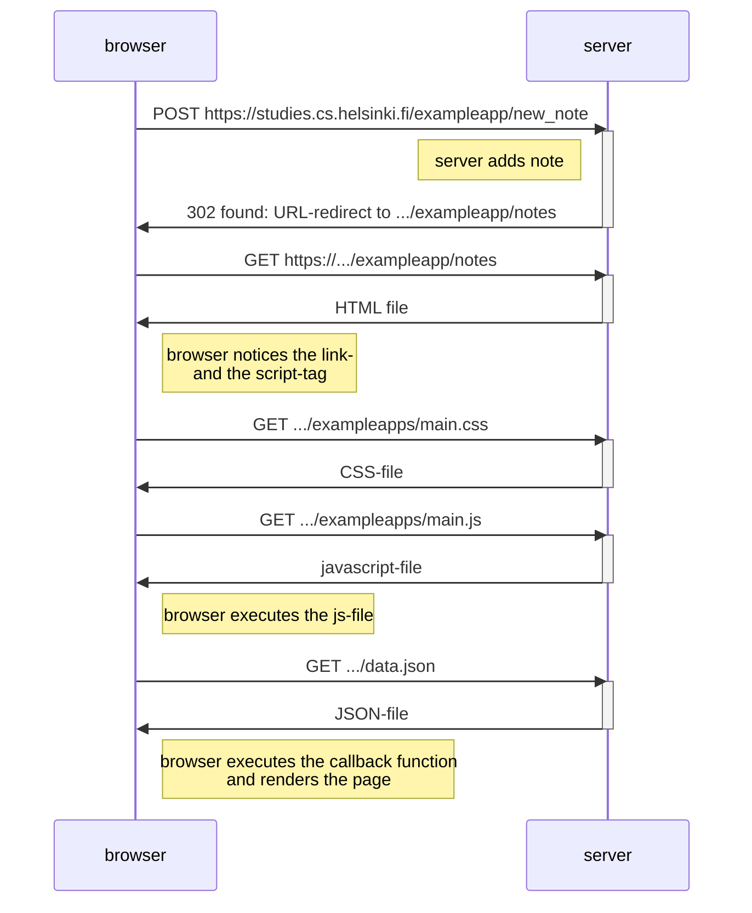

Exercise 0.4: What happens, when we submit a new list entry on the exampleapp page?

```mermaid
sequenceDiagram
    participant browser
    participant server

    browser->>server: POST https://studies.cs.helsinki.fi/exampleapp/new_note 
    activate server
    Note left of server: server adds note
    server->>browser: 302 found: URL-redirect to .../exampleapp/notes
    deactivate server
    browser->>server: GET https://.../exampleapp/notes
    activate server
    server->>browser: HTML file
    deactivate server
    Note right of browser:  browser notices the link- <bR> and the script-tag
    browser->>server: GET .../exampleapps/main.css
    activate server
    server->>browser: CSS-file
    deactivate server
    browser->>server: GET .../exampleapps/main.js
    activate server
    server->>browser: javascript-file
    deactivate server
    Note right of browser: browser executes the js-file
    browser->>server: GET .../data.json
    activate server
    server->>browser: JSON-file
    deactivate server
    Note right of browser: browser executes the callback function <br> and renders the page
```