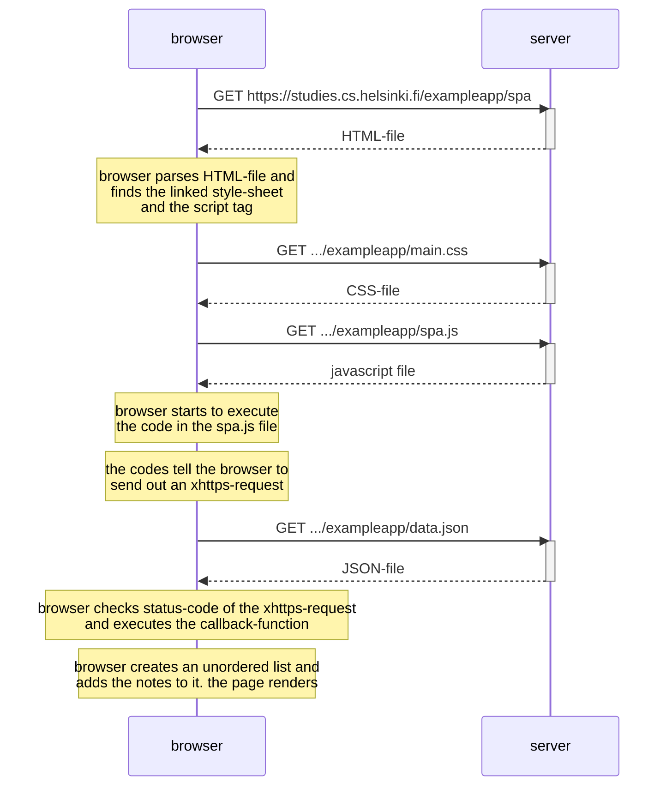

Exercise 0.5: Create a similar diagram for what happens when the user opens the single page version of the example app.

Actually, it looks pretty much the same to what happens in the other version of the app. The difference
of the single page version shows only when one adds a new note via the form at the bottom of the page (see
exercise 0.6).

