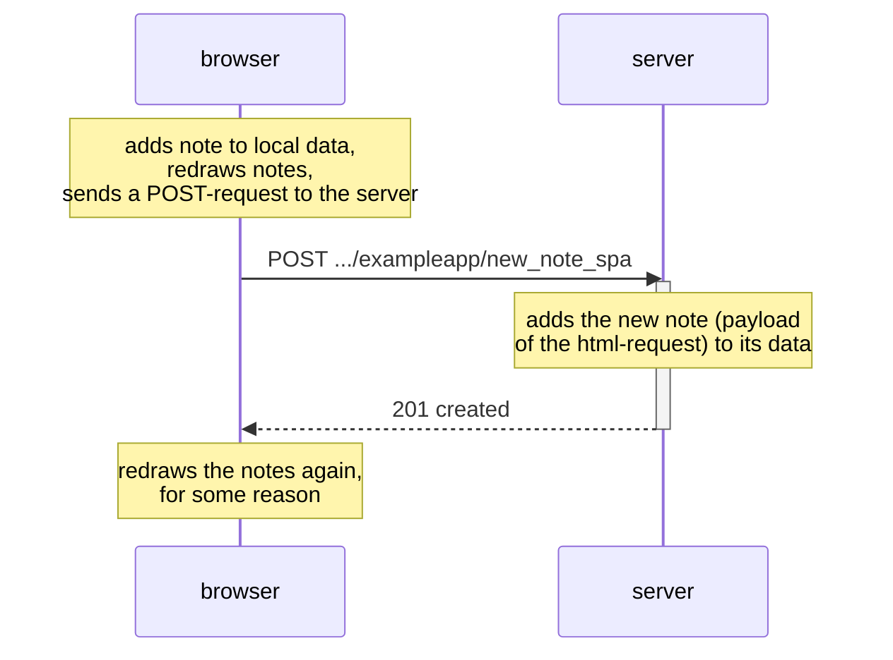

Exercise 0.6: Adding a new note in the single page version of the app.

The difference is, that the browser changes its local data immediately and redraws the page.
After that it sends a POST-request to the server to ask it to update its remote data.

